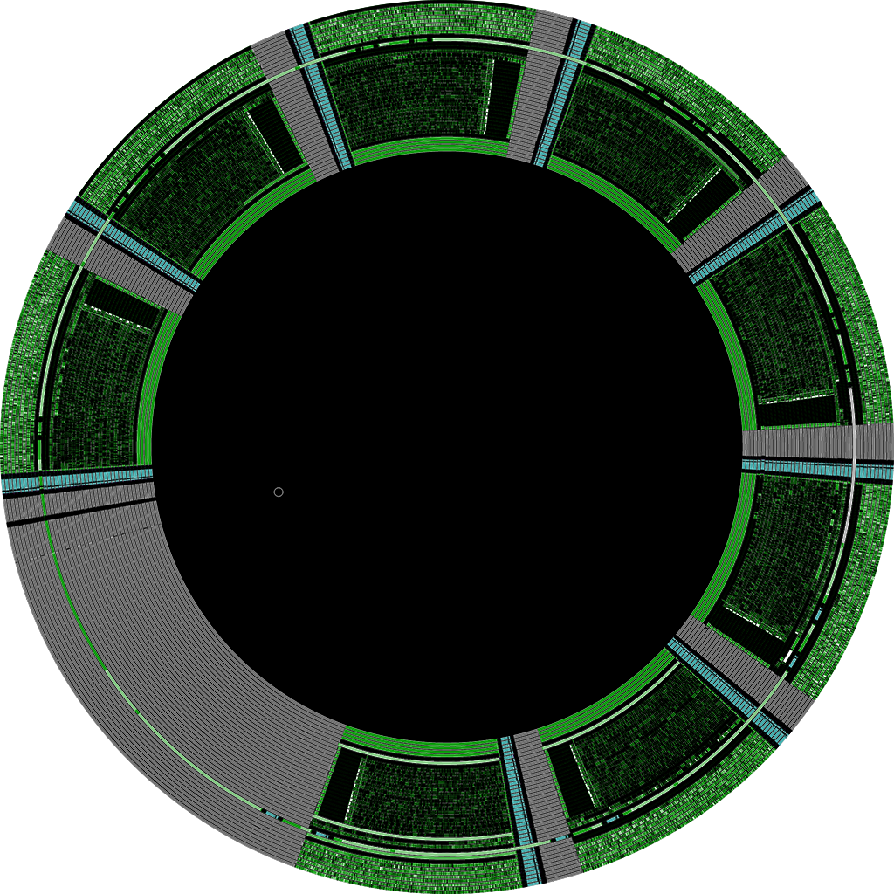

# fluxfox

A floppy disk image library for PC emulators

**This library is under heavy initial development. The API is incredibly unstable, the internal disk representation
is not final, and there are probably a million bugs. I do not recommend using this library until it reaches a more
stable state.**



## Goals

* fluxfox is intended to serve the needs of a PC emulator that wishes to read various disk image formats.
  It provides an interface by which an emulator can load a disk image, then perform operations on the disk image
  consistent with typical operations supported by a floppy disk controller such as the NEC μPD765A.
* fluxfox is not intended to be a general purpose disk image conversion library. There are other tools, (libdisk,
  SAMdisk, HxC, pri/pfi/psi) which are more appropriate for that purpose.

## Disk Image Support

There are a dizzying array of floppy disk image formats - formats often arise to meet the specific needs of
certain hardware platforms and the disk controllers and software protection methods that were common to such
platforms. At least initially, this library will focus on disk image formats that are commonly associated with the
IBM PC platform.

At least partial support for the following disk images is under development:

### Sector-Based Disk Images

Sector-based images encode byte data for each sector, typically with metadata about the sector's id markers and
data CRC status. These images can support many copy-protected titles, but may fail to encode more advanced protections,
sometimes produce impossible track encodings, and are not ideal for archival purposes or research.

* **Raw Sector Image** (IMG, IMA, DSK, etc)
    * Raw sector images are ubiquitous, easily the most common type of disk image used with PC emulators. These files
      simply contain raw sectors in order, which are all assumed to be exactly 512 bytes. No header is present, but the
      layout of the disk can generally be determined by the file size.
    * The obvious limitation of this format is that any non-standard disk layout cannot be represented. However, these
      images are very convenient and simple if working with non-copy-protected images.
* **ImageDisk** (IMD)
    * ImageDisk is a format developed by Dave Dunfield as an open alternative to TeleDisk format images, although it
      has some limitations.
* **Teledisk** (TD0)
    * A disk image format used by Sydex TELEDISK, an early commercial disk-copying program.
    * No official documentation exists, however Dave Dunfield published notes on the disk format and the format is
      supported by a number of tools and emulators.
    * Multiple versions exist, including different compression algorithms. Version 2 Teledisk images may be compressed
      with LZHUF compression. Version 1.x images may use a custom LZW implementation instead.
    * fluxfox currently only supports Version 2.x Teledisk images. It uses LZHUF decompression code graciously borrowed
      from [retrocompressor](https://github.com/dfgordon/retrocompressor) by [dfgordon](https://github.com/dfgordon).
* **PCE Sector Image** (PSI)
    * One of several image formats developed by Hampa Hug for use with his emulator,  [PCE](http://www.hampa.ch/pce/).
      A flexible format based on RIFF-like data chunks.

Eventually, fluxfox should be able to convert sector images to bitstream images, in cases where a
physically impossible track has not been encoded. Certain parameters such as gap lengths could be configured.

### Bitstream Disk Images

Bitstream images store the low-level bit encoding of each track on a diskette. These images typically can encode any
extant protection, given the appropriate metadata (weak and damaged bits), but are more complex than sector images to
manipulate and write back to.

* **PCE Raw Image** (PRI)
    * One of several image formats developed by Hampa Hug for use with his emulator, [PCE](http://www.hampa.ch/pce/).
      Along with track bitstream data, PRI supports weak bit masks.
* **MFM Bitstream Image** (MFM)
    * A bitstream format created for use with the HxC drive emulation software.
    * Only MFM-encoded track data is included. There is no support for weak bits or other metadata.

### Flux-Based Disk Images

These images are created with specialized hardware that records the raw flux transitions reported by a disk drive. This
is
the lowest level of disk image, and is ideal for archival purposes. A flux image typically cannot be written to - nor
would you really want to.

Flux images are the most difficult of the three types of format to read and manipulate. Generally a lengthy conversion
process is required to read and interpret the encoded flux transitions into a usable bitstream representation.

fluxfox currently does not support any flux-based image formats, however support for SCP and Kryoflux images is a long
term goal.

### Disk Encodings

Most floppy images used on the IBM PC used [MFM](https://en.wikipedia.org/wiki/Modified_frequency_modulation) encoding.
Some early, 8-inch floppies used FM encoding instead, however certain disk duplicators or copy protection methods may
have included FM-encoded tracks on otherwise MFM-encoded diskettes. FM-encoded tracks are not currently supported, but
are planned.

Other common encodings, such as Apple's [GCR encoding](https://en.wikipedia.org/wiki/Group_coded_recording), are not
supported as this library concentrates on support for the IBM PC.

## Logging

fluxfox uses [env_logger](https://crates.io/crates/env_logger) for logging output. If your application also uses
env_logger, you will see fluxfox's messages along with your own. If fluxfox's output is too noisy,
you can add `fluxfox=error` to your `RUST_LOG` environment variable to limit output to only critical error messages.

## Visualization

fluxfox can produce a graphical visualization of a disk image if the image is of bitstream resolution or higher, and
includes MFM-encoded data. This currently encompasses PRI and MFM disk image formats.

Visualization requires the `viz` feature to be specified.

An included example, `imgviz`, is a command-line utility that can produce a visualization and save it to PNG.

The following command will run `imgviz` and produce a 1024x1024 (or 2048x1024) resolution visualization with 4x
supersampling:

```
run -p imgviz -- -r=1024 --ss=4 -i "input_image.pri" -o="output.png" 
```

The image will be square with a single disk surface if the image is single-sided. Otherwise, both sides of the disk will
be rendered side by side.

Run with the `-h` parameter to see more command-line options.

An example visualization is shown at the top of this README.

