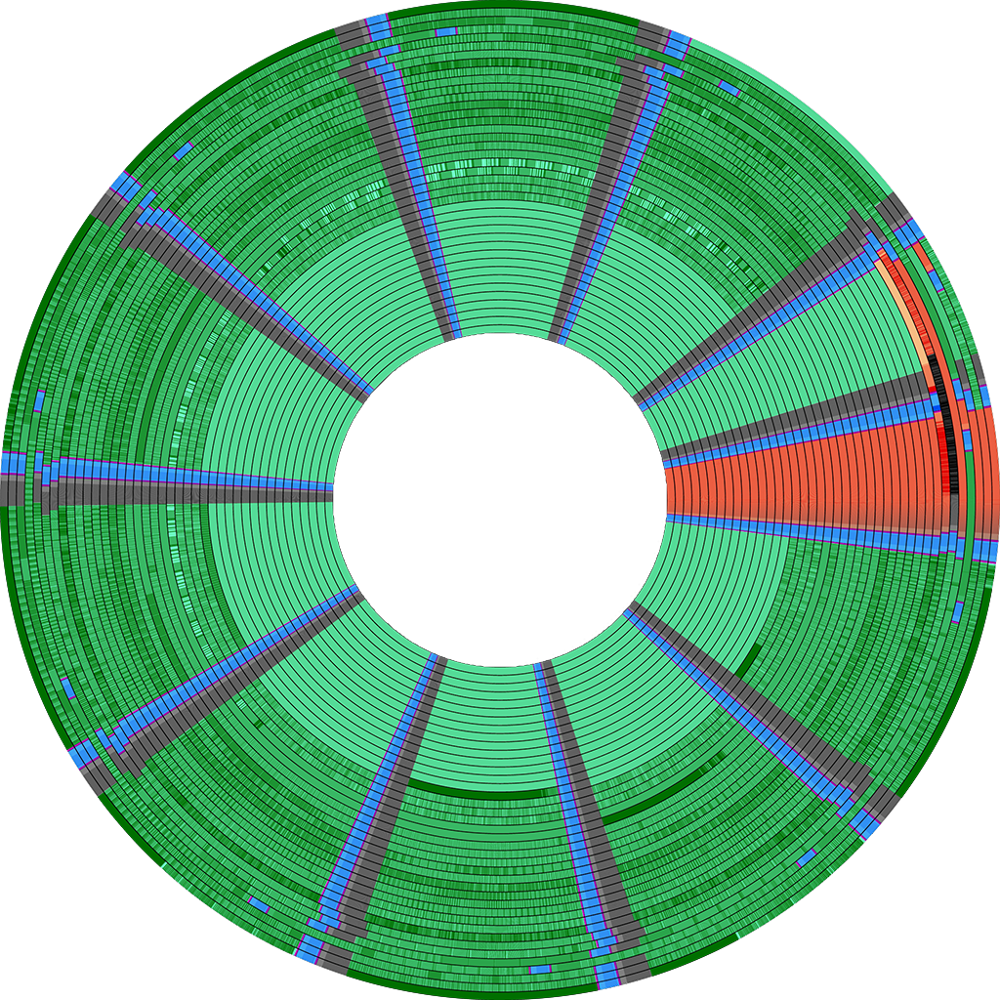

# fluxfox

A floppy disk image library for PC emulators

**This library is under heavy initial development. The API is incredibly unstable, the internal disk representation
is not final, and there are probably a million bugs. I do not recommend using this library until it reaches a more
stable state.**


<p align="center">Arac (1988, Digital Leisure Corporation) showing the signature of MINDER copy protection</p>

## Goals

* fluxfox is intended to serve the needs of a PC emulator that wishes to read various disk image formats.
  It provides an interface by which an emulator can load a disk image, then perform operations on the disk image
  consistent with typical operations supported by a common PC floppy disk controller such as the NEC μPD765A.

### Non-Goals

* fluxfox is not intended to be a general purpose disk image conversion library, although it can write to a few
  supported formats.
  There are other tools, (libdisk, SAMdisk, Applesauce, HxC, pri/pfi/psi) which are more appropriate for that purpose.

## Disk Image Support

There are a dizzying array of floppy disk image formats - formats often arise to meet the specific needs of
certain hardware platforms and the disk controllers and software protection methods that were common to such
platforms. At least initially, this library will focus on disk image formats that are commonly associated with the
IBM PC platform.

At least partial support for the following disk images is under development:

### Raw Sector Images

* **Raw Sector Image** (IMG, IMA, DSK, etc.)
    * Raw sector images are ubiquitous, easily the most common type of disk image used with PC emulators. These files
      simply contain raw sectors in order, which are all assumed to be exactly 512 bytes. No header is present, but the
      layout of the disk can generally be determined by the file size.
    * The obvious limitation of this format is that any non-standard disk layout cannot be represented. However, these
      images are very convenient and simple if working with non-copy-protected images.
    * Fluxfox converts raw sector images into Bitstream images on load.

### Sector-based Disk Images

Sector-based images encode byte data for each sector, typically with metadata about the sector's id markers and CRC
status.
These images can support many copy-protected titles, but may fail to encode more advanced protections, sometimes produce
impossible track encodings, and are not ideal for archival purposes or research. Due to limitations of these formats,
fluxfox treats them as a special `MetaSector` track type.

* **Teledisk** (TD0)
    * A disk image format used by Sydex TELEDISK, an early commercial disk-copying program.
    * No official documentation exists, however Dave Dunfield published notes on the disk format and the format is
      supported by a number of tools and emulators.
    * Multiple versions exist, including different compression algorithms. Version 2 Teledisk images may be compressed
      with LZHUF compression. Version 1.x images may use a custom LZW implementation instead.
    * fluxfox currently only supports Version 2.x Teledisk images. It uses LZHUF decompression code from
      [retrocompressor](https://github.com/dfgordon/retrocompressor) by [dfgordon](https://github.com/dfgordon).
* **ImageDisk** (IMD)
    * ImageDisk is a format developed by Dave Dunfield as an open alternative to TeleDisk format images, although it
      has some encoding limitations.
* **PCE Sector Image** (PSI)
    * One of several image formats developed by Hampa Hug for use with his emulator,  [PCE](http://www.hampa.ch/pce/).
      A flexible format based on RIFF-like data chunks. Perhaps the most advanced of all sector-based disk images, it
      has been used to encode a variety of copy-protected titles.

### Bitstream Disk Images

Bitstream images store the low-level FM or MFM encoded bit stream of each track on a diskette. These images typically
can encode most protection types seen on the PC, given the appropriate metadata (weak and damaged bits), but are more
complex than sector images to manipulate and write back to.

* **PCE Raw Image** (PRI)
    * One of several image formats developed by Hampa Hug for use with his emulator, [PCE](http://www.hampa.ch/pce/).
      Along with track bitstream data, PRI supports weak bit masks.
* **MFM Bitstream Image** (MFM)
    * A bitstream format created for use with the HxC drive emulation software.
    * Only MFM-encoded track data is included. There is no support for weak bits or other metadata.
* **HFE Bitstream Image** (HFE)
    * Another format associated with the HxC software, HFE is also a bitstream container, however unlike MFM it supports
      multiple encoding types. There are several versions of HFE supported by HxC, HFEv3 being the newest, however the
      format is still considered experimental and not finalized. fluxfox supports HFE v1 files.
* **86Box Floppy Image** (86F)
    * A format designed around the internal representation of disks in the 86Box emulator. Bitstream based and flexible
      in terms of per-track parameters, it also allows exact encoding of bitcell length to support track wrapping.

Some Bitstream-level formats, such as MFM and HFE, do not support specifying an absolute bit length. This can cause
problems when emulating certain copy-protection schemes that involve precise handling of reading across the index
(track wrapping).

### Flux-Based Disk Images

These images are created with specialized hardware that records the raw flux transitions reported by a disk drive. This
is the lowest possible level of disk image, and is ideal for archival purposes.

Flux images can be divided into two basic types, solved and unsolved flux.

Unsolved flux images are the most difficult of the three types of format to read and manipulate. Generally a lengthy
conversion process is required to analyze and combine the 3-5 revolutions of each track that is typically captured with
a flux capture device. This makes them less than ideal for the purposes of emulation. Unsolved images cannot really be
written to in a sensible way - nor should you want to.

Solved flux images represent a post-processed flux capture where multiple revolutions have already been analyzed and
combined. The resulting flux stream should represent a correct, clean read of each track. Metadata may need to be
provided along with solved flux images as detection of weak bits, etc., is only possible by comparing multiple
revolutions which are no longer present in a solved image. Solved flux images can technically be written to - but doing
so is a complicated process.

### Raw Flux Images

* **SuperCardPro Image** (SCP)
    * A format designed for the [SuperCardPro](https://www.cbmstuff.com/index.php?route=product/product&product_id=52)
      flux imaging hardware, this format has become quite popular as a single-file flux container. The format supports
      several potentially useful metadata fields, but they are so frequently set to garbage values in SCP images in the
      wild that is impossible to trust them.
    * SCP images can also contain resolved flux tracks, if desired. Some emulators can write back to SCP, but write a
      single revolution.

* **KryoFlux Stream Files** (RAW)
    * Less of an image format, and more of a collection of stream protocol dumps produced by
      the [Kryoflux](https://kryoflux.com/) flux imaging hardware. These 'images' comprise a set of files with the
      `.raw` extension, one file per track.
    * Each track file may contain an arbitrary number of revolutions.

### Resolved Flux Images

* **MAME Flux Image** (MFI)
    * A resolved flux format designed for the famous MAME emulator (which emulates many kinds of computer, not just
      arcade machines.)
    * MFI images contain a single revolution, encoding "zones" of NFA's or surface damage to support various
      copy-protection methods.

### Disk Encodings

Most floppy images used on the IBM PC used [MFM](https://en.wikipedia.org/wiki/Modified_frequency_modulation) encoding.
Some early, 8-inch floppies used FM encoding instead, however certain disk duplicators or copy protection methods may
have included FM-encoded tracks on otherwise MFM-encoded diskettes. FM-encoded tracks are not currently supported, but
are planned.

Other common encodings, such as Apple's [GCR encoding](https://en.wikipedia.org/wiki/Group_coded_recording), are not
supported as this library concentrates on support for the IBM PC.

## Logging

fluxfox uses [env_logger](https://crates.io/crates/env_logger) for logging output. If your application also uses
env_logger, you will see fluxfox's messages along with your own. If fluxfox's output is too noisy,
you can add `fluxfox=error` to your `RUST_LOG` environment variable to limit output to only critical error messages.

## Image Editing

I'm working on a basic disk editor, called ffedit, powered by fluxfox's API.
ffedit is a TUI application, using [Ratatui](ratatui.rs) for its interface. This editor is in very early stages.


## Visualization

fluxfox can produce a graphical visualization of a disk image if the image is of bitstream resolution or higher and
includes MFM-encoded data. This currently encompasses PRI, MFM and HFE disk image formats.

Visualization requires the `viz` feature to be specified.

An included example, `imgviz`, is a command-line utility that can produce a visualization and save it to PNG.

The following command will run `imgviz` and produce a 1024x1024 (or 2048x1024) resolution visualization with 4x
supersampling named `output.png`:

```
cargo run -r -p imgviz -- -i "input.pri" -o="output.png" --angle=2.88 --hole_ratio=0.66 --index_hole --data --metadata --decode --resolution=2048 --ss=4 
```

* The `angle` parameter determines the angle of the index mark on the unit circle for head #0. An angle of 0 is default
  and will place the index mark on the right side (the 3 o'clock position, similar to HxC)
* The `hole_ratio` parameter determines the relative size of the inner radius to the outer radius. A ratio of 0.66 is
  approximately accurate for a 5.25" diskette, mapping to 22mm of servo travel. You may prefer to reduce this factor for
  visualization purposes.
* `index_hole` will render a circle representing the position of the index hole on the diskette.
* `data` will render the data contained in the disk image, either as MFM-encoded or decoded stream, depending on whether
  `decode` is specified.
* `metadata` will overlay colored regions representing sector headers and sector data.
    * Either `data` or `metadata` must be supplied, or no image will be drawn!
* `decode` will decode the MFM-encoded data, showing a representation of the actual data on disk (usually more visually
  interesting)
* `resolution` determines the final output height of the resulting image. If an image is two-sided, it may be double
  this width or more.
* `ss` specifies a supersampling factor. The image will be rendered at this multiple of the specified `resolution` and
  down-sampled using the [fast_image_resize](https://github.com/Cykooz/fast_image_resize) crate.

Be sure to provide the `-r` parameter to cargo run, to run imgviz in release mode. Debug mode will be very slow and use
a lot more memory!

The image will be square with a single disk surface if the image is single-sided. Otherwise, both sides of the disk will
be rendered side by side.

When working with Kryoflux file sets, any file in a set may be used as an input filename.

Run with the `-h` parameter to see more command-line options.

An example visualization is shown at the top of this README.

