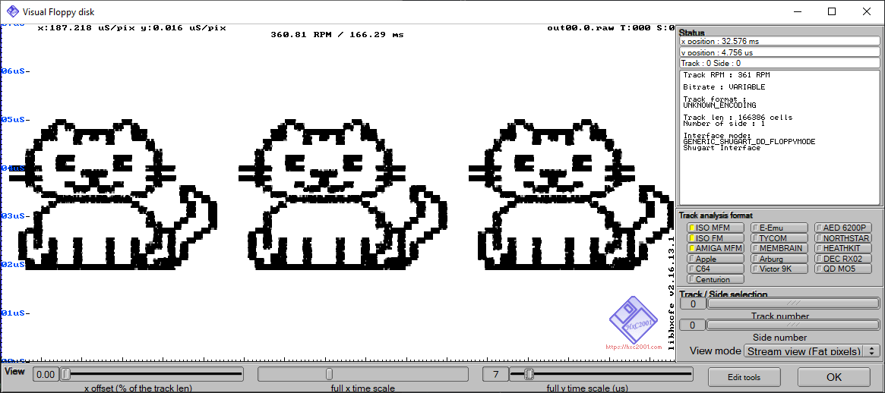
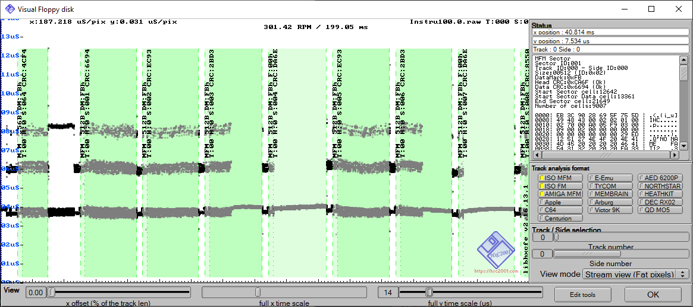
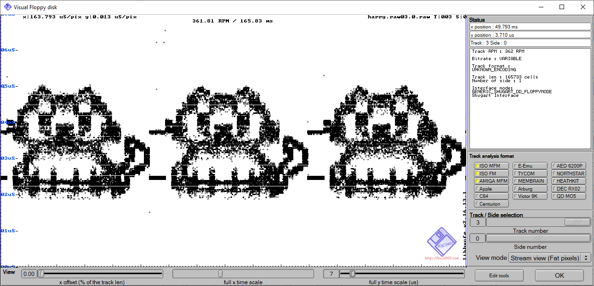

# pbm2track

Render monochrome bitmaps into floppy disk track timing diagrams

## ...Do what now?

A normal track timing diagram is a graph of the delta times between each flux transition on a single track of a floppy
disk. They can be produced by tools such
as [HxC](https://hxc2001.com/download/floppy_drive_emulator/), [AppleSauce](https://applesaucefdc.com/software/),
or [FluxFox](https://fluxfox.martypc.net).

In standard MFM encoding, this will present as three roughly parallel horizontal lines - representing short, medium, and
long transitions.

Such views are useful for evaluating the quality of a floppy disk flux image and diagnosing issues with floppy media or
drives.

However, we can also do stupid stuff with it.

## Painting with Flux

On a graph like this, the flux transitions are tightly packed together - we can use the perceptual density on the x-axis
to pretend as if we have a general X/Y plot.

The `pbm2track` utility samples an input bitmap along the x-axis, selecting a pixel at random from each sampled column.
If the pixel is white, a flux transition is encoded with a time delta proportional to the y-offset of the pixel. A
random jitter factor is then applied to "fill out" the resulting flux lines to turn them into square "fluxcels".

## Using pbm2track

There are a lot of parameters you can tweak but only a few of them are particularly useful.

## Parameters

Here are the various command-line parameters accepted by `pbm2track`:

- `[input PBM]` (required)
    - Path to the input PBM image (P1 ASCII or P4 binary). The PBM image is sampled column-by-column to generate flux
      transitions.

- `--samples N` (required)
    - Total number of samples across one full track. Larger values produce higher horizontal resolution in the generated
      flux stream - but will make the track longer as a consequence.
    - Example: `--samples 50000`.

- `--min-ft US` (required)
    - Minimum flux transition duration, in microseconds. This is the base/shortest transition time used when sampling a
      white pixel near the bottom of the image.

- `--max-ft US` (required)
    - Maximum flux transition duration, in microseconds. The vertical sampling position scales linearly between
      `--min-ft` and `--max-ft`.

- `--jitter-us US` (optional)
    - Uniform random jitter applied to each flux transition (±US microseconds). This controls the apparent vertical
      thickness of each "fluxcel".
    - If omitted, a reasonable default will be calculated from the image height and the min/max ft range, which is
      usually what you want.

- `--seed S` (optional, default: `0x00C0FFEE` = 12648430)
    - RNG seed (u64). Use this to make runs reproducible.

- `--y-mode MODE` (optional, default: `random`)
    - Vertical sampling mode. Valid values: `alternate`, `centroid`, `bottom`, `top`, `random`.
        - `alternate` — cycle through visible rows in a column (useful for multi-row shapes)
        - `centroid` — use the mean (centroid) of visible pixels in the column
        - `bottom` — use the lowest visible pixel (closest to the bottom)
        - `top` — use the highest visible pixel (closest to the top)
        - `random` — pick a visible pixel at random (default)

    - None of these are particularly useful except `alternate` and `random`.

- `--out OUT` (required)
    - Output KryoFlux 'raw' stream filename.
    - Important: the filename must include a track/head spec like `NN.H` immediately before the final `.raw` extension —
      for example `out00.0.raw`

- `--sck-hz HZ` (optional, default: 24027428.57142857)
    - Sample clock frequency (Hz). This value is used to convert flux durations (seconds) into encoder ticks.

- `--ick-hz HZ` (optional, default: 3003428.571428571)
    - Index clock frequency (Hz). Used for index marker spacing in the KryoFlux stream.

- `--index-seed SEED` (optional, default: `123456789`)
    - Starting index counter value written into the KFS index markers.

- `--revs N` (optional, default: `3`)
    - Number of revolutions (repeats) to export. Some tools aren't happy with a single revolution, at least the way this
      tool writes them, so 3 is the default.

- `--kf-name NAME` (optional, default: `pbm2track`)
    - Name field written into the KFInfo metadata in the output stream.

- `--kf-version VER` (optional, default: `1.0`)
    - Version field written into the KFInfo metadata in the output stream.

## Encoding Tips

`--min-ft` and `--max-ft` are specified in microseconds (µs). The gap between them controls the vertical dynamic range
of the resulting flux plot. The length of the track is also directly proportional to the delta between the min and max
ft values.

If you want the output to actually fit on a real floppy disk, you want to avoid using flux transitions less than `2.0us`
for high density media and `4.0us` for double-density media. You can make the maximum flux transition time as large as
you like, but doing so will lengthen the track considerably.

You will want to play with the `samples` and `max-ft` parameters primarily until `pbm2track` produces something
reasonable. The example image at the top of this README was produced with the following parameters:

`pbm2track.exe 3cats.pbm --samples 54700 --min-ft 2.0 --max-ft 5.0 --out out00.0.raw`

Most floppy disks rotate at 300RPM, and so you'll want the track to be no more than 200ms long. `pbm2track` will tell
you how long the track is in ms and will calculate the RPM correspondingly.

High density 5.25" drives (and some high density 3.5" drives too) spin at 360RPM, and so you'll want to be no more than
166ms long.

## Note:

`pbm2track` doesn't actually use FluxFox for anything, it is just a one-off utility, but the flux encoding might
make its way into the library at some point.

We could use the rust [image](https://crates.io/crates/image) crate to support other input image file formats. Feel free
to send a PR that does that if you feel so inclined.

## Writing To Actual Floppies

The tracks produced by this utility do not encode useful data - it's total gibberish, as far as a floppy disk controller
is concerned. I make no guarantees you can actually write any of the files produced by this utility if your writing
software/hardware doesn't like writing raw, unformatted flux nonsense.

If you do want to attempt to write to a disk, I suggest setting the jitter-us parameter to 0 - the write process will
introduce plenty of jitter on its own, and you don't really need to add any.

This is currently the best result I've gotten using a GreaseWeazle 1.4:

There's an interesting vertical smearing effect, and what almost seems like a 'echo' as well. Further research and
experimentation is needed - let me know if you manage to get better results. Encoding something with this much detail
may be difficult, but large, blocky letters should remain legible, at least, so have fun hiding text messages your
disks.

`pbm2track` is presented solely as a novelty with no guarantees of suitability for any purpose.

## I don't see anything in HxC!

Make sure you're in the "Stream View" not the "Track View".

