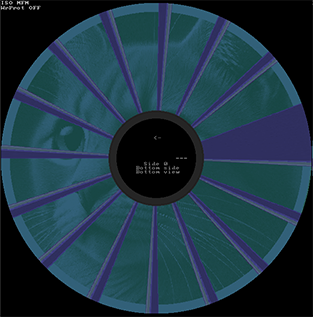

# fluxfox png2disk

Write PNG images to floppy disks with fluxfox.

Such images are invisible to the naked eye, but will appear when opened in a tool that produces a disk surface
visualization.

## Using png2disk

Input images should be 32-bit, RGBA PNGs. Only the red channel is sampled, so convert any source image to grayscale
in your editor, or examine the red channel in isolation to make sure it looks correct.

### Command line arguments:

* `--applesauce` - Format the output for display in the Applesauce disk editor. Applesauce displays the index
  (the start of a track) at the 12 o'clock position, and does not visually flip the second side. Specifying this
  option will rotate the input images 90 degrees clockwise, disable flipping orientation for side 1, and use a hole
  ratio of 0.27.
  If this option is omitted, images will be formatted for display in HxC or fluxfox.
* `--angle` - This can let you override the index position, as an angle in radians. The default is 0 degrees, which
  represents the 3 o'clock position on the unit circle.
* `--in_disk` - The path to a disk image to use as a base. This can be any bitstream level or higher image format
  that fluxfox supports. This parameter is optional - if omitted, png2disk will create a new disk image for you,
  defaulting to a 5.25", high density, 1.2MB disk format.
* `--disk_format` - If `in_disk` is not specified, the default disk format can be overridden with this parameter.
  For best results, a high density, 80 track disk image format is recommended. I have only really tested with the
  default 1.2MB format, so I recommend just sticking to the default.
    * "160k" => 160K 5.25" DD, 40 tracks
    * "180k" => 180K 5.25" DD, 40 tracks
    * "320k" => 320K 5.25" DD, 40 tracks
    * "360k" => 360K 5.25" DD, 40 tracks
    * "720k" => 720K 3.5" DD, 80 tracks
    * "1200k" => 1.2M 5.25" HD, 80 tracks
    * "1440k" => 1.44M 3.5" HD, 80 tracks
    * "2880k" => 2.88M 3.5" ED, 80 tracks
* `--formatted` - If `in_disk` is not specified, this flag determines if the newly created disk image should be DOS
  formatted.
* `--grayscale` - Write a grayscale image to the disk. If this option is omitted, the source image will be interpreted
  as a black and white image with a 50% threshold.
* `--hole_ratio` - The ratio of the inner spindle hole to the outer radius of the disk visualization. The default is
  0.3, which is used by HxC and fluxfox. Applesauce uses a ratio of 0.27. This will be adjusted for you if you specify
  the applesauce flag.
* `--sectors_only` - This flag will restrict writing of image data into sector data regions only. This will result
  in a fully readable disk.

* `--skip` - The number of tracks to preserve, starting at outer track 0. This can leave space for a small filesystem
  if you wish the disk to contain other data.
* `--in_image0` - The path to the PNG file to be used for Head/Side 0 if the disk image.
* `--in_image1` - The path to the PNG file to be used for Head/Side 1 of the disk image.
* `--out_disk` - The path to the output disk image format. This must be a bitstream-level disk image format that fluxfox
  supports for writing. Currently, this is limited to the `86F` and `PRI` formats. The format will be determined by
  extension. HxC can open 86F files and convert them to other formats.

  The `IMG` format does not contain low-level enough information to represent an encoded image.

## Tips

If you are compiling from source, be sure you add the `-r` option to `cargo run` or `build`. Cargo will default to
the debug build profile, which will be very slow.

You cannot use a sector-level disk image as input, such as IMD, TD0, or PSI. The exception is IMG, which will be
converted to a bitstream image with the assumption that it follows a standard disk format.

You don't need a very high resolution input PNG. png2disk will sample a black and white source image with
nearest-neighbor filtering, so even small pixel art should render fine.

The alpha channel of the image will mask rendering. An alpha of < 0.5 will prevent png2disk from writing anything
at that pixel location.

The current grayscale renderer has 16 stops, in a ramp from 0-255. Perceptually, there's almost no point in
more shades. You can preview how this will look with the "posterize" function of your favorite image editor.

## Viewing your Disk Image

To view the resulting disk image, you have the following options.

- Use the [web version of fluxfox's GUI](https://dbalsom.github.io/fluxfox/): Drag the disk image into the browser
  window.
  If necessary, open the visualization window from the Windows menu. In the visualization Layers menu, disable the
  metadata
  layer.
- Use [HxC](https://hxc2001.com/download/floppy_drive_emulator/): (Scroll down to the "HxC Floppy Emulator
  software" link). Click on the "Track Analyzer" button from the main menu, then in the lower right, click the "View
  Mode"
  dropdown and select "Dummy Disk"
    - You may wish to adjust the data overlay opacity. Go to Settings, internal parameters, and scroll down to
      `BMPEXPORT_COLOR_ALPHA`. You can also adjust the colors used by HxC here.
- Use [Applesauce](https://applesaucefdc.com/): Open the image from File > Open Disk Analyzer, or Tools -> Visualize
  Disk. (Mac only)

## Known issues

- This is essentially a hack project, and I'm surprised it even works at all, so please keep the production quality of
  this tool in perspective.
  The renderer is extremely inefficient, and there's lots of overdraw to the disk image that could be avoided.
- This utility inherits all the bugs present in fluxfox, which is still in heavy development. There are known issues
  with the MFI and other flux-format importers.

## Can I really write this to a floppy?

Yes, you can use a disk imaging device to write the image to a real floppy. I recommend the excellent and
inexpensive [Greaseweazle](https://github.com/keirf/greaseweazle/wiki) device.

The quality of the result after reading the image back from a floppy may vary based on the calibration of the drive used
and the consistency of its rotation rate.

Here's an example written to and read back from a YD-380 Type 1711 drive, using a Greaseweazle 4.1:

I didn't even have a blank high density disk to use, so this is a high density image written to a double-density disk!

## Ew, is the cat AI generated?

Yes, the cat "photo" was generated by Dall-E. Now, I have a million cat photos, and initially I was planning to use one,
but it was surprisingly hard to find one that had the ideal characteristics:

- Full dynamic range and contrast
- Dark background
- Perfect focus

It ended up easier to generate an appropriate image.

## Hasn't this been done before?

This may be the first time it has been done in grayscale, but black and white images have been put on floppies before.

Ben Zotto's' [picturedsk](https://github.com/bzotto/picturedsk) can write black and white BMP images to Apple WOZ format
disk images.

Antoine Vignau & Olivier Zardini created [Graffidisk](https://brutaldeluxe.fr/products/apple2/graffidisk/) which can
draw bitmaps to tracks on the Apple II, although the bitmaps are not projected in two dimensions.

The CPC fanzine [FatMag 2023](https://www.cpc-power.com/index.php?page=detail&num=18999) contains a secret message as
well.

Let me know if you aware of any other instances of floppy art!

